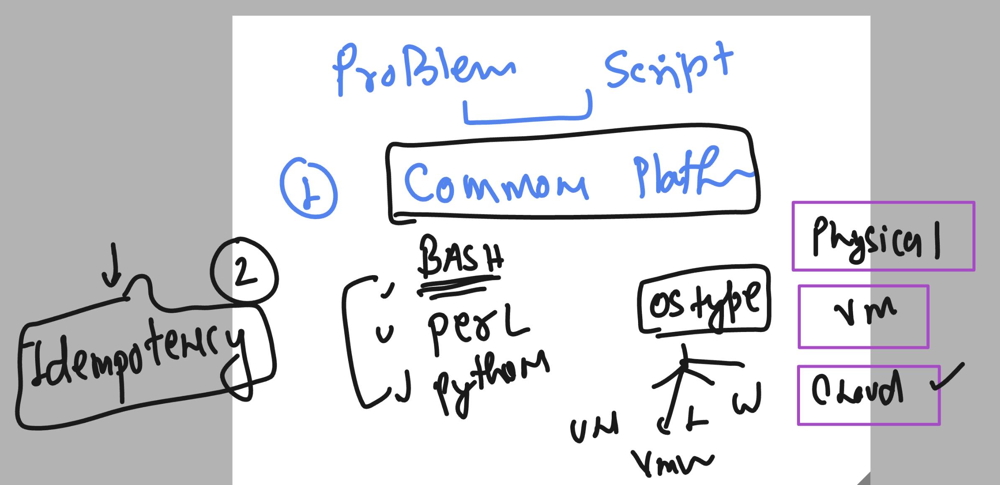
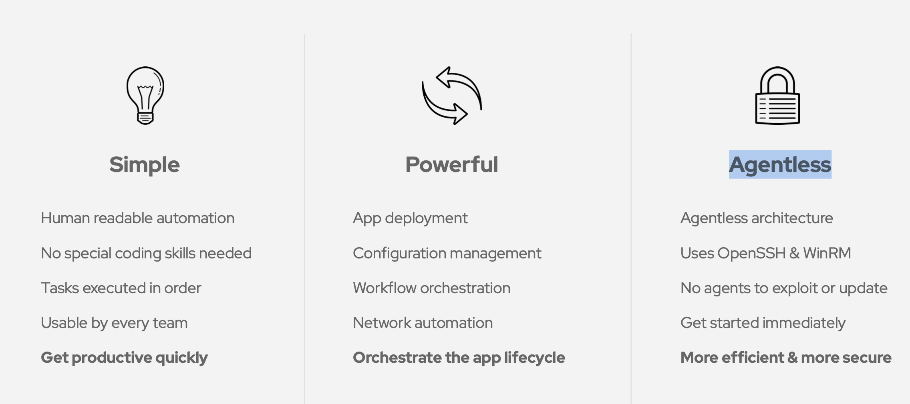
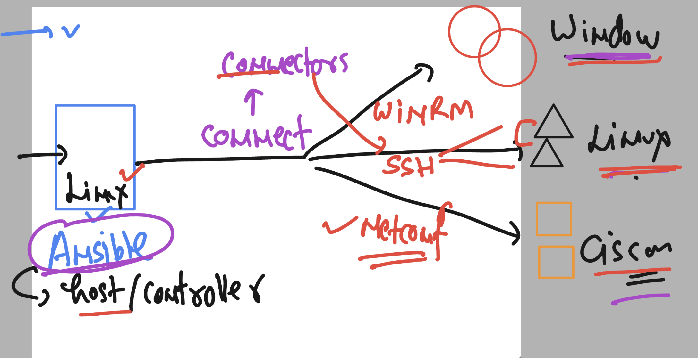
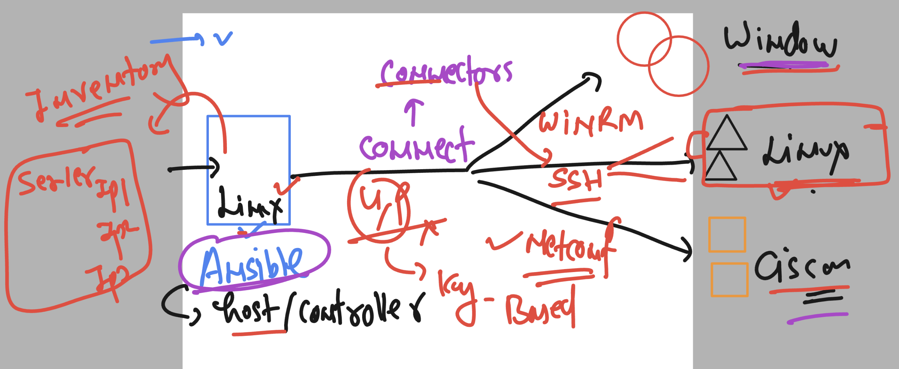

## Problem with sysadmin to hanlde server on a large scale 

### Using scripting methods 


### Scripting problem 



## Introduction to Ansible and why to use it 



### Installation -- on Linux platform -- Opensource ansible -- Install / configure EPEL repo on your system 

```
yum install https://dl.fedoraproject.org/pub/epel/epel-release-latest-7.noarch.rpm
yum install ansible
```

### Verify 

```
rpm -q ansible
ansible-2.9.27-1.el7.noarch
```
### checking config File 

```
[ashu@ip-172-31-93-233 ~]$ rpm -qc  ansible
/etc/ansible/ansible.cfg
/etc/ansible/hosts
```


### checking ansible version 

```
[ashu@ip-172-31-93-233 ~]$ ansible --version 
ansible 2.9.27
  config file = /etc/ansible/ansible.cfg
  configured module search path = [u'/home/ashu/.ansible/plugins/modules', u'/usr/share/ansible/plugins/modules']
  ansible python module location = /usr/lib/python2.7/site-packages/ansible
  executable location = /usr/bin/ansible
  python version = 2.7.18 (default, Feb 28 2023, 02:51:06) [GCC 7.3.1 20180712 (Red Hat 7.3.1-15)]
```

### Ansible version details 


### Ansible connectors 



### Ansible Inventory file 

```
[ashu@ip-172-31-93-233 ~]$ rpm -qc  ansible
/etc/ansible/ansible.cfg
/etc/ansible/hosts
[ashu@ip-172-31-93-233 ~]$ cd  /etc/ansible/
[ashu@ip-172-31-93-233 ansible]$ ls
ansible.cfg  **hosts**  roles
[ashu@ip-172-31-93-233 ansible]$ 


```

### ansible config file 

```
[ashu@ip-172-31-93-233 ~]$ rpm -qc  ansible
/etc/ansible/ansible.cfg
```

### always try to connect ansible target machines from ansible host -- using SSh key based auth 




### for secure and password less connection by ansible machine try to create ssh-keypair in ansible host machine

```

[ashu@ip-172-31-93-233 ~]$ ssh-keygen 
Generating public/private rsa key pair.
Enter file in which to save the key (/home/ashu/.ssh/id_rsa): 
Enter passphrase (empty for no passphrase): 
Enter same passphrase again: 
Your identification has been saved in /home/ashu/.ssh/id_rsa.
Your public key has been saved in /home/ashu/.ssh/id_rsa.pub.
The key fingerprint is:
SHA256:iL9SFe2T5Ggmn2asWuoCh57Ff3PgnCBnmMyiZNzBGxY ashu@ip-172-31-93-233.ec2.internal
The key's randomart image is:
+---[RSA 2048]----+
|         .       |
|   E    . o      |
|  . .    * .     |
|   = ...= =      |
|..* B .BS. .     |
|o=.@ =..*        |
|=o+ =.*+o        |
|.o. .+.B .       |
|   o+oo o        |
+----[SHA256]-----+

```

### transfer public key to remote target machines

```
[ashu@ip-172-31-93-233 ~]$ ssh-copy-id   root@192.168.100.2 
/usr/bin/ssh-copy-id: INFO: Source of key(s) to be installed: "/home/ashu/.ssh/id_rsa.pub"
/usr/bin/ssh-copy-id: INFO: attempting to log in with the new key(s), to filter out any that are already installed
/usr/bin/ssh-copy-id: INFO: 1 key(s) remain to be installed -- if you are prompted now it is to install the new keys
root@192.168.100.2's password: 

Number of key(s) added: 1

Now try logging into the machine, with:   "ssh 'root@192.168.100.2'"
and check to make sure that only the key(s) you wanted were added.

[ashu@ip-172-31-93-233 ~]$ 
[ashu@ip-172-31-93-233 ~]$ ssh-copy-id   root@192.168.101.2 
/usr/bin/ssh-copy-id: INFO: Source of key(s) to be installed: "/home/ashu/.ssh/id_rsa.pub"
/usr/bin/ssh-copy-id: INFO: attempting to log in with the new key(s), to filter out any that are already installed
/usr/bin/ssh-copy-id: INFO: 1 key(s) remain to be installed -- if you are prompted now it is to install the new keys
root@192.168.101.2's password: 

Number of key(s) added: 1

Now try logging into the machine, with:   "ssh 'ro
```

### creating inventory group in ainsble Host machine 

```
[root@ip-172-31-93-233 ansible]# cat  /etc/ansible/hosts
[test]
192.168.100.2
192.168.101.2
```

## Understanding groups in inventory 


### using ping module to test connection of targets hsots

```
[ashu@ip-172-31-93-233 ~]$ ansible   192.168.100.2  -m ping  -u root 
192.168.100.2 | SUCCESS => {
    "ansible_facts": {
        "discovered_interpreter_python": "/usr/bin/python3"
    }, 
    "changed": false, 
    "ping": "pong"
}
[ashu@ip-172-31-93-233 ~]$ ansible   192.168.101.2  -m ping  -u root 
192.168.101.2 | SUCCESS => {
    "ansible_facts": {
        "discovered_interpreter_python": "/usr/bin/python3"
    }, 
    "changed": false, 
    "ping": "pong"
}
[ashu@ip-172-31-93-233 ~]$ 
[ashu@ip-172-31-93-233 ~]$ ansible   test  -m ping  -u root 
192.168.101.2 | SUCCESS => {
    "ansible_facts": {
        "discovered_interpreter_python": "/usr/bin/python3"
    }, 
    "changed": false, 
    "ping": "pong"
}
192.168.100.2 | SUCCESS => {
    "ansible_facts": {
        "discovered_interpreter_python": "/usr/bin/python3"
    }, 
    "changed": false, 
    "ping": "pong"
}

```

### running command on target machine 

```
[ashu@ip-172-31-93-233 ~]$ ansible  test  -u root -m command -a "date"
192.168.101.2 | CHANGED | rc=0 >>
Tue Oct 17 07:37:20 UTC 2023
192.168.100.2 | CHANGED | rc=0 >>
Tue Oct 17 07:37:20 UTC 2023


```

### What we need on the target system 


### ansible python relation 


### Introduction to Ansible Playbook -- using YAML 


## First ansible playbook to run two modules

```
---
- name: choosing target hosts 
  hosts: test 
  tasks:
  - name: using ping module to send ICMP request to all the test group targets
    ping: 
  - name: running a command on target linux host
    command: date 

```

### defining remote_user in playbook

```
---
- name: choosing target hosts 
  hosts: test 
  remote_user: root 
  tasks:
  - name: using ping module to send ICMP request to all the test group targets
    ping: 
  - name: running a command on target linux host
    command: date 


```

### running options

```
ansible-playbook -u root  ashu-playbook1.yaml
ansible-playbook  ashu-playbook1.yaml
```


### checking syntax of the playbook 

```
ansible-playbook --syntax-check  ashu-playbook1.yaml 

playbook: ashu-playbook1.yaml

```


### COncept of custom ansible.cfg and inventory file for particular users


### creating custom ansible.cfg and hosts file

```
/home/ashu/playbooks   ===>>
[ashu@ip-172-31-93-233 playbooks]$ ls
ansible.cfg  ashu-playbook1.yaml  hosts

=======>> hosts --->
[ashu-server]
192.168.100.2
192.168.101.2

====> ansible.cfg

[defaults]
inventory = /home/ashu/playbooks/hosts
remote_user = root
```

