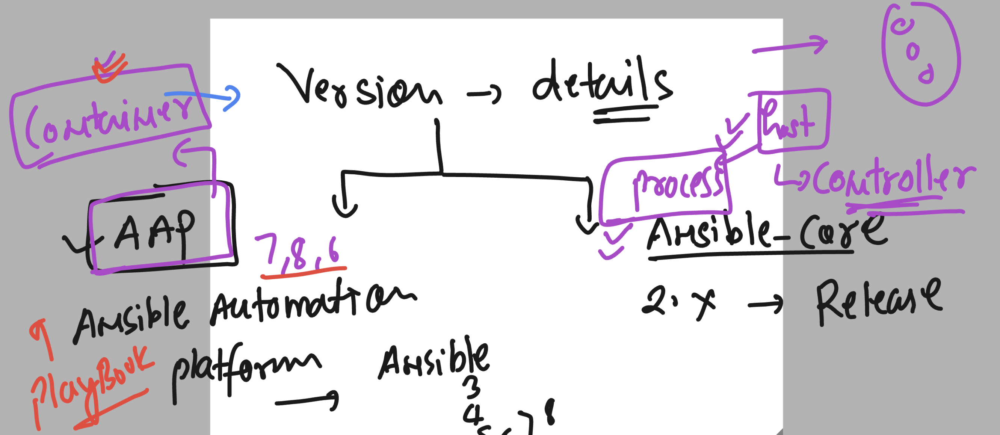

## Problem with sysadmin to hanlde server on a large scale 

### Using scripting methods 


### Scripting problem 


## Introduction to Ansible and why to use it 


### Installation -- on Linux platform -- Opensource ansible -- Install / configure EPEL repo on your system 

```
yum install https://dl.fedoraproject.org/pub/epel/epel-release-latest-7.noarch.rpm
yum install ansible
```

### Verify 

```
rpm -q ansible
ansible-2.9.27-1.el7.noarch
```
### checking config File 

```
[ashu@ip-172-31-93-233 ~]$ rpm -qc  ansible
/etc/ansible/ansible.cfg
/etc/ansible/hosts
```


### checking ansible version 

```
[ashu@ip-172-31-93-233 ~]$ ansible --version 
ansible 2.9.27
  config file = /etc/ansible/ansible.cfg
  configured module search path = [u'/home/ashu/.ansible/plugins/modules', u'/usr/share/ansible/plugins/modules']
  ansible python module location = /usr/lib/python2.7/site-packages/ansible
  executable location = /usr/bin/ansible
  python version = 2.7.18 (default, Feb 28 2023, 02:51:06) [GCC 7.3.1 20180712 (Red Hat 7.3.1-15)]
```

### Ansible version details 



### Ansible connectors 


### Ansible Inventory file 

```
[ashu@ip-172-31-93-233 ~]$ rpm -qc  ansible
/etc/ansible/ansible.cfg
/etc/ansible/hosts
[ashu@ip-172-31-93-233 ~]$ cd  /etc/ansible/
[ashu@ip-172-31-93-233 ansible]$ ls
ansible.cfg  **hosts**  roles
[ashu@ip-172-31-93-233 ansible]$ 


```

### ansible config file 

```
[ashu@ip-172-31-93-233 ~]$ rpm -qc  ansible
/etc/ansible/ansible.cfg
```

### always try to connect ansible target machines from ansible host -- using SSh key based auth 


