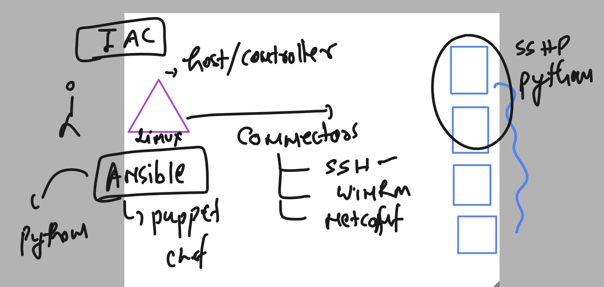
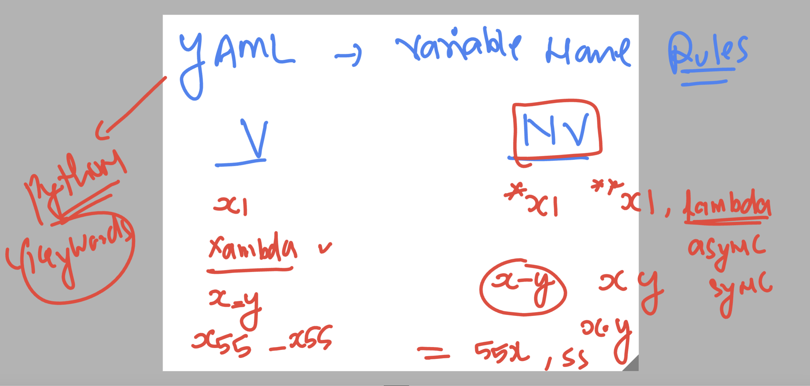
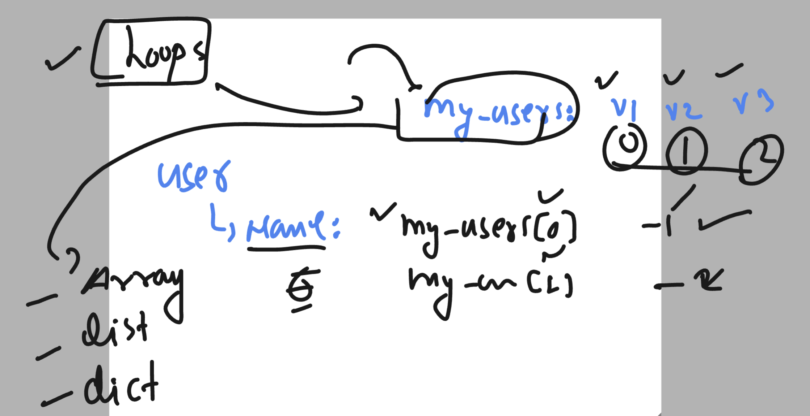

# ansible-vodafone

### Revision --



### testing adhoc command 

```
ashu@ip-172-31-93-233 playbooks]$ cat hosts 
[ashu_apps]
192.168.100.2
192.168.101.2
[ashu@ip-172-31-93-233 playbooks]$ ansible  ashu_apps -m ping 
192.168.101.2 | SUCCESS => {
    "ansible_facts": {
        "discovered_interpreter_python": "/usr/bin/python3"
    }, 
    "changed": false, 
    "ping": "pong"
}
192.168.100.2 | SUCCESS => {
    "ansible_facts": {
        "discovered_interpreter_python": "/usr/bin/python3"
    }, 
    "changed": false, 
    "ping": "pong"
}
[ashu@ip-172-31-93-233 playbooks]$ ansible  ashu_apps -m command -a date
192.168.101.2 | CHANGED | rc=0 >>
Wed Oct 18 05:02:38 UTC 2023
192.168.100.2 | CHANGED | rc=0 >>
Wed Oct 18 05:02:38 UTC 2023

```

### targeting all the groups 

```
[ashu@ip-172-31-93-233 playbooks]$ cat  hosts 
[ashu_apps]
192.168.100.2
192.168.101.2


[ashu_common]
192.168.100.70
192.168.101.70
[ashu@ip-172-31-93-233 playbooks]$ ansible  ashu_apps,ashu_common -m ping 
192.168.100.2 | SUCCESS => {
    "ansible_facts": {
        "discovered_interpreter_python": "/usr/bin/python3"
    }, 
    "changed": false, 
    "ping": "pong"
}
192.168.101.2 | SUCCESS => {
    "ansible_facts": {
        "discovered_interpreter_python": "/usr/bin/python3"
    }, 
    "changed": false, 
    "ping": "pong"
}
192.168.100.70 | SUCCESS => {
    "ansible_facts": {
        "discovered_interpreter_python": "/usr/bin/python3"
    }, 
    "changed": false, 
    "ping": "pong"
}
192.168.101.70 | SUCCESS => {
    "ansible_facts": {
        "discovered_interpreter_python": "/usr/bin/python3"
    }, 
    "changed": false, 
    "ping": "pong"
}
[ashu@ip-172-31-93-233 playbooks]$ ansible  all  -m ping 
192.168.101.2 | SUCCESS => {
    "ansible_facts": {
        "discovered_interpreter_python": "/usr/bin/python3"
    }, 
    "changed": false, 
    "ping": "pong"
}
192.168.101.70 | SUCCESS => {
    "ansible_facts": {
        "discovered_interpreter_python": "/usr/bin/python3"
    }, 
    "changed": false, 
    "ping": "pong"
}
192.168.100.70 | SUCCESS => {
    "ansible_facts": {
        "discovered_interpreter_python": "/usr/bin/python3"
    }, 
    "changed": false, 
    "ping": "pong"
}
192.168.100.2 | SUCCESS => {
    "ansible_facts": {
        "discovered_interpreter_python": "/usr/bin/python3"
    }, 
    "changed": false, 
    "ping": "pong"
}

```

## apache httpd based ansible playbook

### playbook -- 

```
[ashu@ip-172-31-93-233 playbooks]$ cat  apache_httpd.yaml 
---
- name: Install and configure apache httpd on selected groups
  hosts: ashu_apps # this is my group from my inventory 
  tasks: # we will be using all the modules to perform operations 
  - name: update all the software
    yum: 
     name: '*'
     state: latest 


```

### check syntax and run it 

```
[ashu@ip-172-31-93-233 playbooks]$ ansible-playbook --syntax-check apache_httpd.yaml 

playbook: apache_httpd.yaml


[ashu@ip-172-31-93-233 playbooks]$ ansible-playbook  apache_httpd.yaml 

PLAY [Install and configure apache httpd on selected groups] ********************************************************************************

TASK [Gathering Facts] **********************************************************************************************************************
ok: [192.168.101.2]
ok: [192.168.100.2]

TASK [update all the software] **************************************************************************************************************

```

### final apache playbook

```
---
- name: Install and configure apache httpd on selected groups
  hosts: ashu_apps  # this is my group from my inventory 
  tasks: # we will be using all the modules to perform operations 
  - name: update all the software
    yum: 
     name: '*'
     state: latest 
  - name: Installing httpd software
    yum: 
     name: httpd
     state: present 
  - name: Start httpd service 
    service:
     name: httpd
     state: started
     enabled: yes
  - name: copy webpage from ansible machine to both the target server
    copy: 
     src: pages/index.html
     dest: /var/www/html/index.html
```

## Ansible Variables 

### COnsidering YAML and Python -- for variable names validity 



### var1 demo

```
---
- name: testing variables
  hosts: ashu_apps
  vars: # for creating variable
   x: "ashuotshh"
  tasks:
  - name: using debug module 
    debug: 
     msg: "Hello {{ x }}"
```

### var 2 demo

```
---
- name: testing variables
  hosts: ashu_apps
  vars: # for creating variable
   x: "ashuotshh"
   z: 2023
  tasks:
  - name: to print just value of variable 
    debug:
     var: x 
  - name: using debug module 
    debug: 
     msg: "Hello {{ x }} How are you ? In {{z}} "

```

### we can replace variable values in runtime

```
ansible-playbook  var_test1.yaml   -e "x=jack" -e z=2024
```

## reading variables from external File 

```
[ashu@ip-172-31-93-233 playbooks]$ ls
ansible.cfg  apache_httpd.yaml  ashu-playbook1.yaml  hosts  hosts1  pages  task1.yaml  var_test1.yaml  var_test2.yaml  vars

[ashu@ip-172-31-93-233 playbooks]$ ls vars/
myvar.yaml

[ashu@ip-172-31-93-233 playbooks]$ cat  vars/myvar.yaml 
myuser: ashu1
mypass: Ok@12345


[ashu@ip-172-31-93-233 playbooks]$ cat  var_test2.yaml 
---
- name: testing variables
  hosts: ashu_apps
  vars: # for creating variable
   x: "ashuotshh"
   z: 2023
  vars_files: # reading variables from external file 
  - vars/myvar.yaml
  tasks:
  - name: to print just value of variable 
    debug:
     var: x 
  - name: using debug module 
    debug: 
     msg: 
     - "Hello {{ x }} How are you ? In {{z}} "
     - "Hey i want to create a user named {{ myuser }}"
     - "{{myuser}} password must be {{mypass}} "
```

### task1 solution 

### structure 

```
[ashu@ip-172-31-93-233 playbooks]$ ls  task1
data_vars  use_vars.yaml
[ashu@ip-172-31-93-233 playbooks]$ ls  task1/data_vars/
httpd.yaml  user.yaml
[ashu@ip-172-31-93-233 playbooks]$ cat task1/data_vars/user.yaml 
user_name: joe
user_password: Hei@123
[ashu@ip-172-31-93-233 playbooks]$ cat task1/data_vars/httpd.yaml 
pkg: httpd
[ashu@ip-172-31-93-233 playbooks]$ 


```

### use_vars.yaml

```
---
- name: using variable to perform task
  hosts: ashu_apps
  vars_files:
    - data_vars/user.yaml
    - data_vars/httpd.yaml
  tasks:
    - name: creating user 
      user:
        name: "{{ user_name }}"
        password: "{{ user_password | password_hash('sha512') }}"
        # user_password is the name of variable
    - name: Install "{{ pkg }}"
      yum:
        name: "{{ pkg }}"
        state: present 
    - name: service "{{ pkg }}" starting 
      service:
        name: "{{ pkg }}"
        state: started
        enabled: yes

```

### --

```
[ashu@ip-172-31-93-233 playbooks]$ cat task1/data_vars/user.yaml 
user_name: joe
user_password: Hei@123

```

### ---

```
[ashu@ip-172-31-93-233 playbooks]$ cat task1/data_vars/httpd.yaml 
pkg: httpd
```

### Using Registry 

```
- hosts: ashu_apps
  tasks:
  - name: running date command 
    command: date
    register: ashu_out  # this variable will be created and store output of date command 
  - name: printing data
    debug: 
     var: ashu_out  # printing values
```

### running play in a particular host 

```
ansible-playbook  register_var.yaml  --limit=192.168.101.2
```

### task 2 -- using Register 

```
---
- name: choosing target hosts 
  hosts: ashu_apps
  tasks:
  - name: using ping module to send ICMP request to all the test group targets
    ping: 
  - name: creating user
    user:
     name: jack-ashu
     password: "{{ '12345' | password_hash('sha512') }}"

  - name: installing httpd software
    yum:
     name: httpd
     state: present

  - name: running data  date command 
    command: date
    register: x

  - name: printing output 
    debug: 
     var: x.stdout

  - name: copy data to targets 
    copy:
      content: "{{ x.stdout }}"
      dest: /var/www/html/stdout.html  

  - name: starting httpd
    service:
      name: httpd
      state: started
      enabled: yes

```

### array in variables section of ansible playbook 

```
---
- hosts: ashu_apps
  vars:
    my_software: 
    - httpd
    - vsftpd
    - telnet 
    my_users: # considering my_users as array 
    - ashutoshh
    - kumar
    - ansible1
    - harry
    - jack

  tasks:
  - name: printing data
    debug:
     var: my_users

  - name: printing data with particular location 
    debug:
      var: my_users[-1] # printing only first location data refer  my_users[0] , my_users[0:2]
```

### whenever we use array , list or dictonary then use loop to give values one by one 




## Using loops example 1

```
---
- hosts: ashu_apps
  vars:
    my_software: 
    - httpd
    - vsftpd
    - telnet 
    my_users: # considering my_users as array 
    - ashutoshh
    - kumar
    - ansible1
    - harry
    - jack

  tasks:
  - name: printing data
    debug:
     var: my_users

  - name: printing data with particular location 
    debug:
      var: my_users[-1] # printing only first location data refer  my_users[0] , my_users[0:2]

  - name: creating user
    user:
     name: "{{ item }}" 
    loop: "{{ my_users }}" # for  item in my_users: print(item)

  - name: installing software 
    yum:
      name: "{{ item }}"
      state: present
    loop: "{{ my_software }}" # loop 

```

### using loop 2 

```
---
- hosts: ashu_apps
  vars:
    my_users: # considering my_users as array 
    - ashutoshh
    - kumar
    - ansible1
    - harry
    - jack

  tasks:
  - name: printing data
    debug:
     var: my_users

  - name: printing data with particular location 
    debug:
      var: my_users[-1] # printing only first location data refer  my_users[0] , my_users[0:2]

  - name: creating user
    user:
     name: "{{ item }}" 
    loop: "{{ my_users }}" # for  item in my_users: print(item)

  - name: installing software 
    yum:
      name: "{{ item }}"
      state: present
    loop:
      - httpd
      - ftp
      - vsftpd

```
