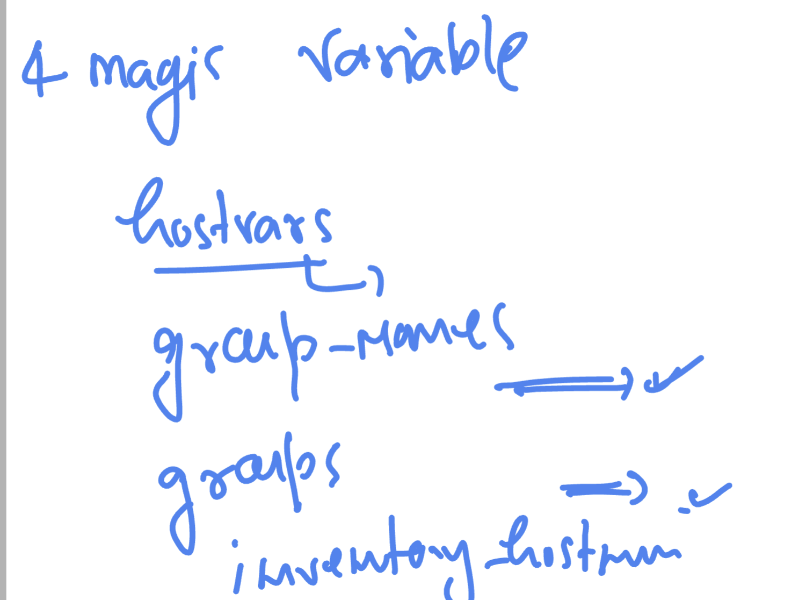

# ansible-vodafone

### Understanding facts with built-in variables 

### in facts gathering we can do filter

```
[ashu@ip-172-31-93-233 playbooks]$ ansible  192.168.100.2 -m setup -a "filter=ansible_user_dir" 
192.168.100.2 | SUCCESS => {
    "ansible_facts": {
        "ansible_user_dir": "/root", 
        "discovered_interpreter_python": "/usr/bin/python"
    }, 
    "changed": false
}
[ashu@ip-172-31-93-233 playbooks]$ ansible  192.168.100.2 -m setup -a "filter=ansible_user*" 
192.168.100.2 | SUCCESS => {
    "ansible_facts": {
        "ansible_user_dir": "/root", 
        "ansible_user_gecos": "root", 
        "ansible_user_gid": 0, 
        "ansible_user_id": "root", 
        "ansible_user_shell": "/bin/bash", 
        "ansible_user_uid": 0, 
        "ansible_userspace_architecture": "x86_64", 
        "ansible_userspace_bits": "64", 
        "discovered_interpreter_python": "/usr/bin/python"
    }, 
    "changed": false
}
[ashu@ip-172-31-93-233 playbooks]$ ansible  localhost  -m setup -a "filter=ansible_user*" 
localhost | SUCCESS => {
    "ansible_facts": {
        "ansible_user_dir": "/home/ashu", 
        "ansible_user_gecos": "", 
        "ansible_user_gid": 1002, 
        "ansible_user_id": "ashu", 
        "ansible_user_shell": "/bin/bash", 
        "ansible_user_uid": 1002, 
        "ansible_userspace_architecture": "x86_64", 
        "ansible_userspace_bits": "64"
    }, 
    "changed": false

```

### scope of variables 


### Host and groups variable in ansible 


### creating new strucure 

```
[ashu@ip-172-31-93-233 ~]$ ls
playbooks
[ashu@ip-172-31-93-233 ~]$ mkdir  ashu-project 
[ashu@ip-172-31-93-233 ~]$ ls
ashu-project  playbooks

[ashu@ip-172-31-93-233 ~]$ pwd
/home/ashu

[ashu@ip-172-31-93-233 ~]$ ls
ashu-project  playbooks

[ashu@ip-172-31-93-233 ~]$ 
[ashu@ip-172-31-93-233 ~]$ cp -v playbooks/hosts  ashu-project/
‘playbooks/hosts’ -> ‘ashu-project/hosts’
[ashu@ip-172-31-93-233 ~]$ cp -v playbooks/ansible.cfg  ashu-project/
‘playbooks/ansible.cfg’ -> ‘ashu-project/ansible.cfg’
[ashu@ip-172-31-93-233 ~]$ 

```

### sample var_test yaml 

```
---
- hosts: ashu_apps
  tasks:
  - name: using debug
    debug:
      msg: "hello world i am using host variable "
```

### Example of host vars -- it has more preference than ansible.cfg

```
[ashu@ip-172-31-93-233 ashu-project]$ ls
ansible.cfg  hosts  test_var.yaml

[ashu@ip-172-31-93-233 ashu-project]$ cat  test_var.yaml 
---
- hosts: ashu_apps
  tasks:
  - name: using debug
    debug:
      msg: "hello world i am using host variable "

  - name: checking target current loging user 
    command: whoami
    register: out

  - name: checking user 
    debug:
      var: out.stdout


[ashu@ip-172-31-93-233 ashu-project]$ cat hosts 
[ashu_apps]
192.168.100.2
192.168.101.2 ansible_user=check


[ashu@ip-172-31-93-233 ashu-project]$ cat  ansible.cfg 
[defaults]
inventory = /home/ashu/ashu-project/hosts
remote_user = root 
deprecation_warnings=False
[ashu@ip-172-31-93-233 ashu-project]$ 


```

### Group variables 

```
ashu@ip-172-31-93-233 ashu-project]$ cat  hosts 
[ashu_apps]
192.168.100.2
192.168.101.2 ansible_user=check 


[db_server]
192.168.100.70
192.168.101.70


# definging group variable 
[db_server:vars]
x=100
pkg=ftp

```

### Group variable concept 

```
[ashu@ip-172-31-93-233 ashu-project]$ cat  hosts 
[ashu_apps]
192.168.100.2
192.168.101.2 ansible_user=check 


[db_server]
192.168.100.70
192.168.101.70


# definging group variable 
[db_server:vars]
x=100
pkg=ftp


[ashu@ip-172-31-93-233 ashu-project]$ ls
ansible.cfg  hosts  test_var.yaml
[ashu@ip-172-31-93-233 ashu-project]$ cp  test_var.yaml   group_test.yaml
[ashu@ip-172-31-93-233 ashu-project]$ ls
ansible.cfg  group_test.yaml  hosts  test_var.yaml

[ashu@ip-172-31-93-233 ashu-project]$ vim group_test.yaml 
[ashu@ip-172-31-93-233 ashu-project]$ cat  group_test.yaml 
---
- hosts: db_server
  tasks:
  - name: using debug
    debug:
      msg: "my first variable vaiuel is {{ x }} and second var value is {{ pkg }}"


[ashu@ip-172-31-93-233 ashu-project]$ ansible-playbook  group_test.yaml 

PLAY [db_server] ********************************************************************************************************************************************

TASK [Gathering Facts] **************************************************************************************************************************************
ok: [192.168.101.70]
ok: [192.168.100.70]

TASK [using debug] ******************************************************************************************************************************************
ok: [192.168.100.70] => {
    "msg": "my first variable vaiuel is 100 and second var value is ftp"
}
ok: [192.168.101.70] => {
    "msg": "my first variable vaiuel is 100 and second var value is ftp"
}

PLAY RECAP **************************************************************************************************************************************************
192.168.100.70             : ok=2    changed=0    unreachable=0    failed=0    skipped=0    rescued=0    ignored=0   
192.168.101.70             : ok=2    changed=0    unreachable=0    failed=0    skipped=0    rescued=0    ignored=0   


```

### hosts vs groups variables and their precedence 

```
[ashu@ip-172-31-93-233 ashu-project]$ ansible-playbook  group_test.yaml 

PLAY [db_server] ********************************************************************************************************************************************

TASK [Gathering Facts] **************************************************************************************************************************************
ok: [192.168.101.70]
ok: [192.168.100.70]

TASK [using debug] ******************************************************************************************************************************************
ok: [192.168.100.70] => {
    "msg": "my first variable vaiuel is 100 and second var value is ftp"
}
ok: [192.168.101.70] => {
    "msg": "my first variable vaiuel is 500 and second var value is ftp"
}

PLAY RECAP **************************************************************************************************************************************************
192.168.100.70             : ok=2    changed=0    unreachable=0    failed=0    skipped=0    rescued=0    ignored=0   
192.168.101.70             : ok=2    changed=0    unreachable=0    failed=0    skipped=0    rescued=0    ignored=0   

[ashu@ip-172-31-93-233 ashu-project]$ cat  hosts 
[ashu_apps]
192.168.100.2
192.168.101.2 ansible_user=check 


[db_server]
192.168.100.70
192.168.101.70  x=500  # host variables 


# definging group variable 
[db_server:vars]
x=100
pkg=ftp

```


### final host and group vars example 

```
[ashu@ip-172-31-93-233 ashu-project]$ cat  hosts 
[ashu_apps]
192.168.100.2
192.168.101.2 ansible_user=check 


[db_server]
192.168.100.70
192.168.101.70  x=500  # host variables 


# definging group variable 
[db_server:vars]
x=100
pkg=ftp


# create a children group 
[common:children]
ashu_apps
db_server


# lets define varibales
[common:vars]
data=hello
z=101
[ashu@ip-172-31-93-233 ashu-project]$ 
[ashu@ip-172-31-93-233 ashu-project]$ cat  group_test.yaml 
---
- hosts: db_server
  tasks:
  - name: using debug
    debug:
      msg: "my first variable vaiuel is {{ x }} and second var value is {{ pkg }}"

# creating a new playgroup 
- hosts: all
  tasks:
  - name: all the nodes in both is having access of z variable 
    debug:
      msg: "hello z is accessible from the node {{ ansible_hostname }} having value {{ z }}"


```

###  THe New method of implementing Host and group variables concept 

```
[ashu@ip-172-31-93-233 ashu-project]$ tree 
.
├── ansible.cfg
├── group_vars
│   ├── ashu_apps
│   ├── common
│   └── db_server
├── hosts
└── host_vars

2 directories, 5 files
[ashu@ip-172-31-93-233 ashu-project]$ cat  hosts 
[ashu_apps]
192.168.100.2
192.168.101.2 


[db_server]
192.168.100.70
192.168.101.70  


[common:children]
ashu_apps
db_server


[ashu@ip-172-31-93-233 ashu-project]$ cat  group_vars/db_server 
pkg: httpd
x: 200
[ashu@ip-172-31-93-233 ashu-project]$ cat  group_vars/ashu_apps 
pkg: ftp
y: 201
x: 400
[ashu@ip-172-31-93-233 ashu-project]$ cat  group_vars/common 
scan_net: nmap
data: hello
b: 5000


```

### lets test it 

```
[ashu@ip-172-31-93-233 ashu-project]$ cat  test_playbook1.yaml 
---
- hosts: db_server
  tasks:
    - name: trying to test variable access 
      debug: 
       msg:
         - "hey i am trying to get the value of pkg variable   {{ pkg }}" 
         - "hey i am trying to get the value of x  variable {{ x }}"


[ashu@ip-172-31-93-233 ashu-project]$ ansible-playbook  test_playbook1.yaml 

PLAY [db_server] ********************************************************************************************************************************************

TASK [Gathering Facts] **************************************************************************************************************************************
ok: [192.168.101.70]
ok: [192.168.100.70]

TASK [trying to test variable access] ***********************************************************************************************************************
ok: [192.168.100.70] => {
    "msg": [
        "hey i am trying to get the value of pkg variable   httpd", 
        "hey i am trying to get the value of x  variable 200"
    ]
}
ok: [192.168.101.70] => {
    "msg": [
        "hey i am trying to get the value of pkg variable   httpd", 
        "hey i am trying to get the value of x  variable 200"
    ]
}

PLAY RECAP **************************************************************************************************************************************************
192.168.100.70             : ok=2    changed=0    unreachable=0    failed=0    skipped=0    rescued=0    ignored=0   
192.168.101.70             : ok=2    changed=0    unreachable=0    failed=0    skipped=0    rescued=0    ignored=0   


```

### Magic variables 



### Using Include -- 

```
[ashu@ip-172-31-93-233 ashu-project]$ 
[ashu@ip-172-31-93-233 ashu-project]$ 
[ashu@ip-172-31-93-233 ashu-project]$ cd ..
[ashu@ip-172-31-93-233 ~]$ ls
ashu-project  backup  playbooks  task-day3
[ashu@ip-172-31-93-233 ~]$ mkdir include_examples
[ashu@ip-172-31-93-233 ~]$ cp -v ashu-project/ansible.cfg  include_examples/
‘ashu-project/ansible.cfg’ -> ‘include_examples/ansible.cfg’
[ashu@ip-172-31-93-233 ~]$ cp -v ashu-project/hosts  include_examples/
‘ashu-project/hosts’ -> ‘include_examples/hosts’
[ashu@ip-172-31-93-233 ~]$ cd include_examples/
[ashu@ip-172-31-93-233 include_examples]$ ls
ansible.cfg  hosts
[ashu@ip-172-31-93-233 include_examples]$ cat hosts 
[ashu_apps]
192.168.100.2
192.168.101.2 


[db_server]
192.168.100.70
192.168.101.70  


[common:children]
ashu_apps
db_server

```

### example of Include and include_vars 

```
[ashu@ip-172-31-93-233 include_examples]$ ls
ansible.cfg  hosts  install_pkg.yaml  myvar.yaml  start_service.yaml  usevar_playbook.yaml
[ashu@ip-172-31-93-233 include_examples]$ cat  myvar.yaml 
---
packages:
  web_pkg: httpd
  db_pkg: mariadb-server 
[ashu@ip-172-31-93-233 include_examples]$ cat  install_pkg.yaml 
---
- name: install software  "{{ packages['web_pkg'] }}"
  yum:
    name: "{{ packages['web_pkg'] }}"
    state: present
[ashu@ip-172-31-93-233 include_examples]$ 
[ashu@ip-172-31-93-233 include_examples]$ 
[ashu@ip-172-31-93-233 include_examples]$ cat start_service.yaml 
---
- name: starting service  "{{ packages['web_pkg'] }}"
  service:
    name: "{{ packages['web_pkg'] }}"
    state: started
    enabled: yes
[ashu@ip-172-31-93-233 include_examples]$ cat  usevar_playbook.yaml 
---
- hosts: ashu_apps
  tasks:
    - name: calling include statement
      include_vars: myvar.yaml

    - name: using those vars
      debug:
        msg: "using  variables {{ packages['web_pkg'] }}"

    - name: install "{{ packages['web_pkg'] }}"
      include: install_pkg.yaml

    - name: starting  "{{ packages['web_pkg'] }}"
      include: start_service.yaml

```

## Understanding conditional statement 


### using when with ignore_errors

```
---
- hosts: ashu_apps
  vars:
    x1: "ftp1"
  tasks:
  - name: installing
    yum:
     name: "{{ x1 }}"
     state: present 
    ignore_errors: yes # if this tasks fails do not terminate playbook running 
    register: myout 

  - name: show
    debug: 
     var: myout 

  - name: start httpd service if installation of ftp happend successfully
    service:
      name: httpd
      state: started
    when: myout.rc == 0 

```
