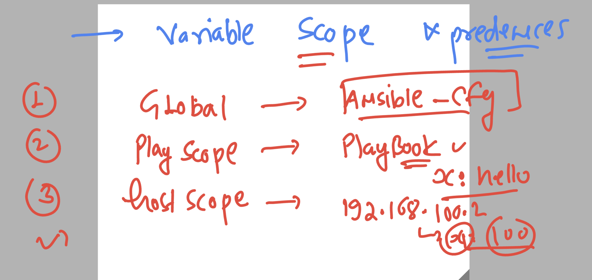
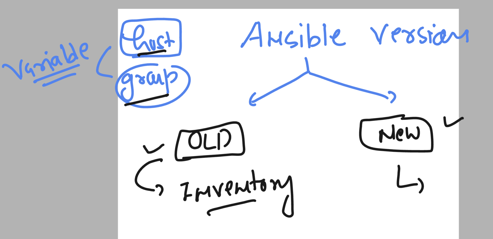

# ansible-vodafone

### Understanding facts with built-in variables 

### in facts gathering we can do filter

```
[ashu@ip-172-31-93-233 playbooks]$ ansible  192.168.100.2 -m setup -a "filter=ansible_user_dir" 
192.168.100.2 | SUCCESS => {
    "ansible_facts": {
        "ansible_user_dir": "/root", 
        "discovered_interpreter_python": "/usr/bin/python"
    }, 
    "changed": false
}
[ashu@ip-172-31-93-233 playbooks]$ ansible  192.168.100.2 -m setup -a "filter=ansible_user*" 
192.168.100.2 | SUCCESS => {
    "ansible_facts": {
        "ansible_user_dir": "/root", 
        "ansible_user_gecos": "root", 
        "ansible_user_gid": 0, 
        "ansible_user_id": "root", 
        "ansible_user_shell": "/bin/bash", 
        "ansible_user_uid": 0, 
        "ansible_userspace_architecture": "x86_64", 
        "ansible_userspace_bits": "64", 
        "discovered_interpreter_python": "/usr/bin/python"
    }, 
    "changed": false
}
[ashu@ip-172-31-93-233 playbooks]$ ansible  localhost  -m setup -a "filter=ansible_user*" 
localhost | SUCCESS => {
    "ansible_facts": {
        "ansible_user_dir": "/home/ashu", 
        "ansible_user_gecos": "", 
        "ansible_user_gid": 1002, 
        "ansible_user_id": "ashu", 
        "ansible_user_shell": "/bin/bash", 
        "ansible_user_uid": 1002, 
        "ansible_userspace_architecture": "x86_64", 
        "ansible_userspace_bits": "64"
    }, 
    "changed": false

```

### scope of variables 



### Host and groups variable in ansible 



### creating new strucure 

```
[ashu@ip-172-31-93-233 ~]$ ls
playbooks
[ashu@ip-172-31-93-233 ~]$ mkdir  ashu-project 
[ashu@ip-172-31-93-233 ~]$ ls
ashu-project  playbooks

[ashu@ip-172-31-93-233 ~]$ pwd
/home/ashu

[ashu@ip-172-31-93-233 ~]$ ls
ashu-project  playbooks

[ashu@ip-172-31-93-233 ~]$ 
[ashu@ip-172-31-93-233 ~]$ cp -v playbooks/hosts  ashu-project/
‘playbooks/hosts’ -> ‘ashu-project/hosts’
[ashu@ip-172-31-93-233 ~]$ cp -v playbooks/ansible.cfg  ashu-project/
‘playbooks/ansible.cfg’ -> ‘ashu-project/ansible.cfg’
[ashu@ip-172-31-93-233 ~]$ 

```

### sample var_test yaml 

```
---
- hosts: ashu_apps
  tasks:
  - name: using debug
    debug:
      msg: "hello world i am using host variable "
```

