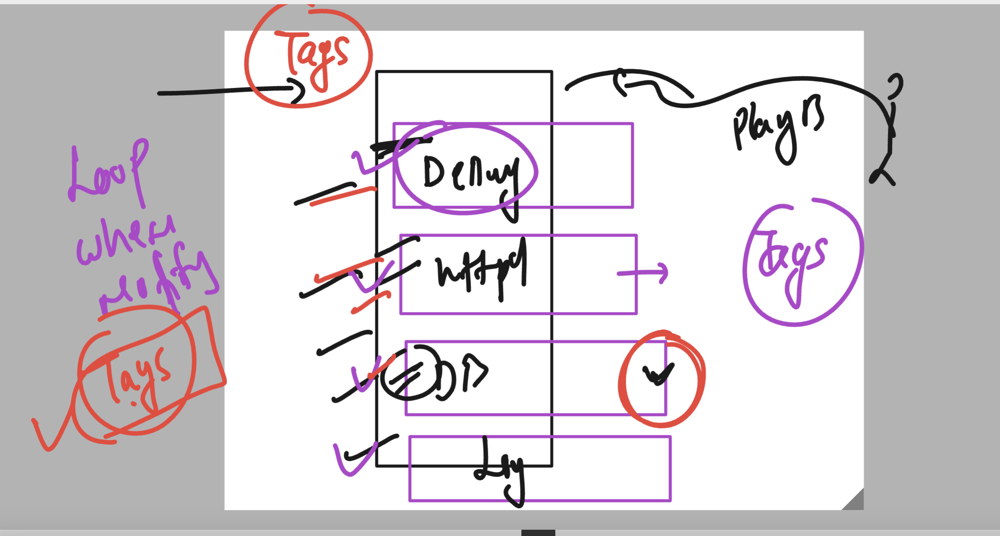

# ansible-vodafone

## Revision 


### CHoosing best way approach creating structure 

```
tree  day4-case1/
day4-case1/
├── ansible.cfg
├── group_vars
├── hosts
└── host_vars

```

### adding group and host vars 

```
[ashu@ip-172-31-93-233 day4-case1]$ cat hosts
[ashu_server]
192.168.100.2
192.168.101.2


[ashu_db]
192.168.100.70


[ashu_fileshare]
192.168.101.70

[ashu_patch:children]
ashu_server
ashu_db

=======>>

[ashu@ip-172-31-93-233 day4-case1]$ tree 
.
├── ansible.cfg
├── group_vars
│   ├── ashu_db
│   ├── ashu_fileshare
│   ├── ashu_patch
│   └── ashu_server
├── hosts
└── host_vars
    ├── 192.168.100.2
    ├── 192.168.100.70
    ├── 192.168.101.2
    └── 192.168.101.70

2 directories, 10 files

```

### Understanding privileges escalation in ansible 


### Adding privileges part in ansible.cfg

```
[defaults]
inventory = ./hosts
remote_user = test
deprecation_warnings=False


[privilege_escalation]
become=True
become_method=sudo
become_user=root

```

### always use become method in playbooks

```
---
- hosts: 192.168.101.2 
  become: true
  tasks:
  - name: printing general message
    debug: 
     msg:  
      - "hello {{ inventory_hostname }}"
      - "ashutoshh machine is running "

  - name: uninstall httpd and vsftpd , ftp 
    yum:
      name: "{{ item }}"
      state: installed 
    loop:
      - httpd
      - vsftpd 
      - ftp

```


## demo Handlers

### sample playbook

```
[ashu@ip-172-31-93-233 day4-case1]$ cat  group_vars/ashu_server 
pkg: httpd
[ashu@ip-172-31-93-233 day4-case1]$ cat handler_playbook.yaml 
---
- hosts: 192.168.101.2 
  become: true
  tasks:
  - name: printing general message
    debug: 
     msg:  
      - "hello {{ inventory_hostname }}"
      - "ashutoshh machine is running "
  - name: install {{ pkg }}
    yum: 
     name: "{{ pkg }}" 
     state: present 

  - name: copy web page to apache httpd server 
    copy: 
     src:  web/index.html 
     dest: /var/www/html/ 

  - name: starting "{{ pkg }}"
    service:
     name: "{{ pkg }}"
     state: started
     enabled: true 

[ashu@ip-172-31-93-233 day4-case1]$ cat  web/index.html 
<h1>  Hello world  this is ashutoshh  </h1>
[ashu@ip-172-31-93-233 day4-case1]$ 

```

### adding handler 

```
---
- hosts: ashu_server
  become: true
  tasks:
  - name: printing general message
    debug: 
     msg:  
      - "hello {{ inventory_hostname }}"
      - "ashutoshh machine is running "
  - name: install {{ pkg }}
    yum: 
     name: "{{ pkg }}" 
     state: present 

  - name: copy web page to apache httpd server 
    copy: 
     src:  web/index.html 
     dest: /var/www/html/ 
    notify: # to detect changes in this task 
    - ashu_restart_httpd 

  - name: starting "{{ pkg }}"
    service:
     name: "{{ pkg }}"
     state: started
     enabled: true

  handlers: # this is trigger by notify keyword changes detection 
  - name: ashu_restart_httpd 
    service:
      name: "{{ pkg }}"
      state: restarted 


```

### handles tasks

```
[ashu@ip-172-31-93-233 day4-case1]$ cat group_vars/ashu_server 
pkg: httpd

users:
 - u001
 - u002
 - u003
 - u004
[ashu@ip-172-31-93-233 day4-case1]$ cat  handler_playbook.yaml 
---
- hosts: ashu_server
  become: true
  handlers: # this is trigger by notify keyword changes detection 
  - name: ashu_restart_httpd 
    service:
      name: "{{ pkg }}"
      state: restarted 
  - name: ashu_user_created
    copy:
      content: "my user details are --->> {{ users }}"
      dest: /var/www/html/user.html

  tasks:
  - name: printing general message
    debug: 
     msg:  
      - "hello {{ inventory_hostname }}"
      - "ashutoshh machine is running "
  - name: install {{ pkg }}
    yum: 
     name: "{{ pkg }}" 
     state: present 

  - name: copy web page to apache httpd server 
    copy: 
     src:  web/index.html 
     dest: /var/www/html/ 
    notify: # to detect changes in this task 
    - ashu_restart_httpd 

  - name: starting "{{ pkg }}"
    service:
     name: "{{ pkg }}"
     state: started
     enabled: true

  - name: creating users 
    user:
      name: "{{ item}}"
      state: present 
    loop: "{{ users }}"
    notify:
    - ashu_user_created


```

### a better solution 

```
---
- hosts: ashu_server
  become: true
  handlers: # this is trigger by notify keyword changes detection 
  - name: ashu_restart_httpd 
    service:
      name: "{{ pkg }}"
      state: restarted 

  - name: ashu_user_created
    lineinfile:
      line: " {{ item }}"
      path: /var/www/html/user1.html
    loop: "{{ users }}"


  tasks:
  - name: printing general message
    debug: 
     msg:  
      - "hello {{ inventory_hostname }}"
      - "ashutoshh machine is running "
  - name: install {{ pkg }}
    yum: 
     name: "{{ pkg }}" 
     state: present 

  - name: copy web page to apache httpd server 
    copy: 
     src:  web/index.html 
     dest: /var/www/html/ 
    notify: # to detect changes in this task 
    - ashu_restart_httpd 

  - name: starting "{{ pkg }}"
    service:
     name: "{{ pkg }}"
     state: started
     enabled: true

  - name: creating users 
    user:
      name: "{{ item}}"
      state: present 
    loop: "{{ users }}"
    notify:
    - ashu_user_created


```

### running specific part of playbook 

### understnading tags



### playbook

```
---
- hosts: ashu_server
  become: true
  handlers: # this is trigger by notify keyword changes detection 
  - name: ashu_restart_httpd 
    service:
      name: "{{ pkg }}"
      state: restarted 

  - name: ashu_user_created
    file:
      path: /var/www/html/user1.html 
      state: touch
  - name: ashu_user_created
    lineinfile:
      line: " {{ item }}"
      path: /var/www/html/user1.html
    loop: "{{ users }}"


  tasks:
  - name: printing general message
    debug: 
     msg:  
      - "hello {{ inventory_hostname }}"
      - "ashutoshh machine is running "
  - name: install {{ pkg }}
    yum: 
     name: "{{ pkg }}" 
     state: present 

  - name: copy web page to apache httpd server 
    copy: 
     src:  web/index.html 
     dest: /var/www/html/ 
    notify: # to detect changes in this task 
    - ashu_restart_httpd 

  - name: starting "{{ pkg }}"
    service:
     name: "{{ pkg }}"
     state: started
     enabled: true
    tags:
    - ashu_start

  - name: creating users 
    user:
      name: "{{ item}}"
      state: present 
    loop: "{{ users }}"
    notify:
    - ashu_user_created
    tags: # to call the task while running playbokk
    - ashu_start


```

### commands

```
1293  ansible-playbook handler_playbook.yaml --list-tags

 1295  ansible-playbook handler_playbook.yaml  --tags "ashu_user_test"
 1296  ansible-playbook handler_playbook.yaml  --tags "ashu_user_test" --tags "ashu_start"
 1297  history 
 1298  ansible-playbook handler_playbook.yaml  --skip-tags "ashu_user_test" 
 1299  vim handler_playbook.yaml 
 1300  ansible-playbook handler_playbook.yaml  --tags "ashu_start"


```

### using include with handlers and tags

```
[ashu@ip-172-31-93-233 day4-case2]$ ls
ansible.cfg  copy.yaml  group_vars  hosts  host_vars  httpd.yaml  main.yaml

[ashu@ip-172-31-93-233 day4-case2]$ cat  httpd.yaml 
---
- name: install "{{ pkg }}"
  yum:
    name: "{{pkg}}"
    state: installed

- name: starting  "{{ pkg }}"
  service:
    name: "{{pkg}}"
    state: started
    enabled: yes


[ashu@ip-172-31-93-233 day4-case2]$ cat  copy.yaml 
---
- name: creating index.html to apache httpd
  copy:
    content: "hello worl this is apache httpd with ansible "
    dest: /var/www/html/index.html 
  notify:
    - copy_new_data


[ashu@ip-172-31-93-233 day4-case2]$ cat  main.yaml 
---
- name: targeting my hosts
  hosts: ashu_server
  handlers:
  - name: copy_new_data # calling change in copy data 
    service:
     name: "{{pkg}}"
     state: restarted

  tasks:
  - name: Installing httpd 
    include: httpd.yaml 
    tags:
      - call_for_install

  - name: copy web page to  httpd 
    include: copy.yaml 
    tags:
      - call_for_copy


```

### Using error handlers 

```

---
- hosts: ashu_server,ashu_demo
  become: true 
  ignore_errors: yes
  tasks:
  - name: installing "{{ soft }}"
    yum:
      name: "{{ soft }}"
      state: installed 
    register: out

  - name: priting status
    debug:
      var: out 

```

### hanldling error without ignoring them 

```
---
- hosts: ashu_server,ashu_demo
  become: true 
  #ignore_errors: yes
  tasks:
  - block: # collection of task -- here you implement when , tags, notify etc undre block 
    - name: installing "{{ soft }}"
      yum:
       name: "{{ soft }}"
       state: installed 
      register: out

    - name: priting status
      debug:
       var: out 
    rescue:  # if tasks under block got failed then rescue will be trigger 
    - name: ashu_custom_repo  
      yum_repository:
       name:  ashu_repo
       baseurl: https://pkgs.k8s.io/core:/stable:/v1.28/rpm/
       description: ashu repo for kubectl 
       gpgcheck: yes
       enabled: yes
       state: present 
       gpgkey: https://pkgs.k8s.io/core:/stable:/v1.28/rpm/repodata/repomd.xml.key

    always: # either block or resuce anything is running or not alwayes will be always executed
    - name: i am unstoppable 
      debug:
        msg: "My life is easy"

```


