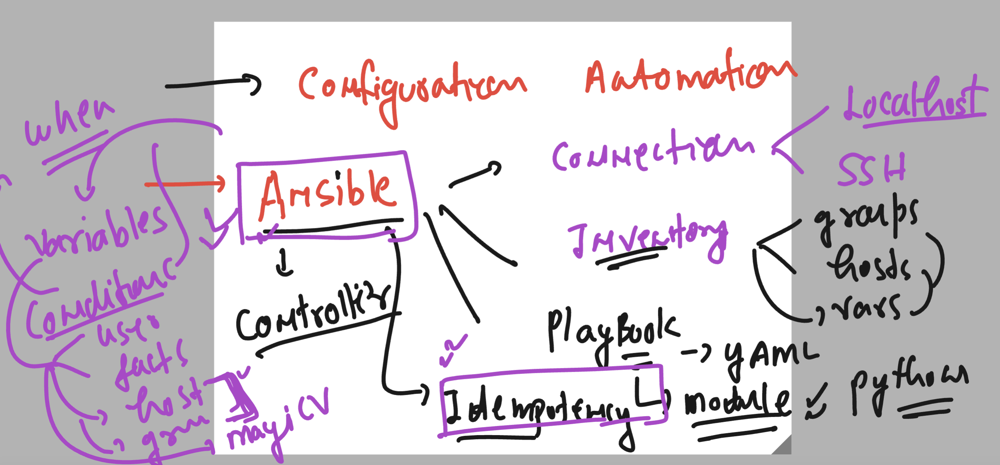
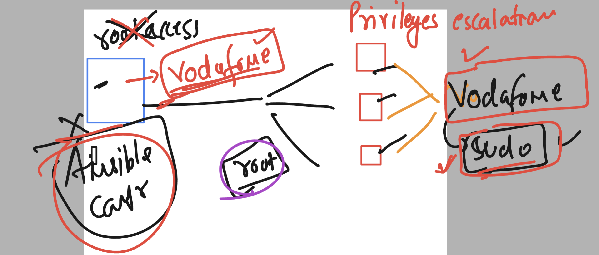

# ansible-vodafone

## Revision 



### CHoosing best way approach creating structure 

```
tree  day4-case1/
day4-case1/
├── ansible.cfg
├── group_vars
├── hosts
└── host_vars

```

### adding group and host vars 

```
[ashu@ip-172-31-93-233 day4-case1]$ cat hosts
[ashu_server]
192.168.100.2
192.168.101.2


[ashu_db]
192.168.100.70


[ashu_fileshare]
192.168.101.70

[ashu_patch:children]
ashu_server
ashu_db

=======>>

[ashu@ip-172-31-93-233 day4-case1]$ tree 
.
├── ansible.cfg
├── group_vars
│   ├── ashu_db
│   ├── ashu_fileshare
│   ├── ashu_patch
│   └── ashu_server
├── hosts
└── host_vars
    ├── 192.168.100.2
    ├── 192.168.100.70
    ├── 192.168.101.2
    └── 192.168.101.70

2 directories, 10 files

```

### Understanding privileges escalation in ansible 




